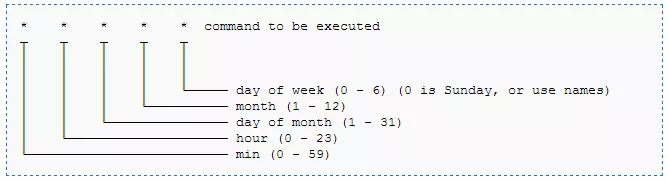

# Odoo

_En este repositorio se detallará los pasos a seguir para instalar ODOO en un servidor Linux de 64bits mediante contenedores docker o instalarlo en una raspberry pi a través de un script._


### Pre-requisitos 📋

_Para instalar odoo mediante contenedores docker es necesario tener instalado docker y docker compose en nuestro terminal._


### Instalación 🔧

_Se deberá ejecutar el archivo docker-compose.yml para instalar el servicio ODOO 13 y su base de datos postgres de la siguiente manerta:_


```
docker-compose up -d
```


_Una vez finalizada la descarga e instalación de ODOO con su base de datos Postgres, el servicio estará corriendo de manera automática en el puerto 8069. Esto se puede cambiar mediante el archivo docker-compose.yml modificando la línea de puertos. También se habrá creado una carpeta en su escritorio que contendrá las descargas de su script._

_La instalación mediante contenedores solo funciona en servidores que dispongan de una arquitectura de 64bits.._


## Backup 💽
_Para poder realizar un backup a través del terminal se deberá ejecutar el siguiente script._


```
sh bk_odoo.sh
```

_Una vez ejecutado el script comenzará la descarga en el directorio donde se haya ejecutado. El tiempo promedio de descarga de los backups variará corresponiendo al peso del archivo_


## Automatización de backup 🔄
_Para automatizar el backup deberá añadir el script al archivo "crontab" de linux, que es el que se encarga de realizar tareas repetitivas en el servidor._
_Ingrese en su terminal la siguiente línea de comandos._

```
sudo -s crontab -e
```
_En caso de haberlo abierto por primera vez deberá seleccionar con cual editor de texto desea editarlo_

_Una vez dentro del archivo crontab deberá ingresar en el final del archivo el script de backup con el horario en el que desea que se ejecuten automáticamente._

_El siguiente ejemplo es válido para utilizarlo en una raspberry._

```
00 02 * * * /home/pi/odoo/backup/bk_odoo.sh

```
_Esto ejecutará el script todos los días a las 2AM_

_El uso de crontab se detalla en la siguiente imagen:_




## Autores ✒️


* **Matias Gonzalez** - desarrollo de script y documentación - [matijego](https://github.com/matijego)


---